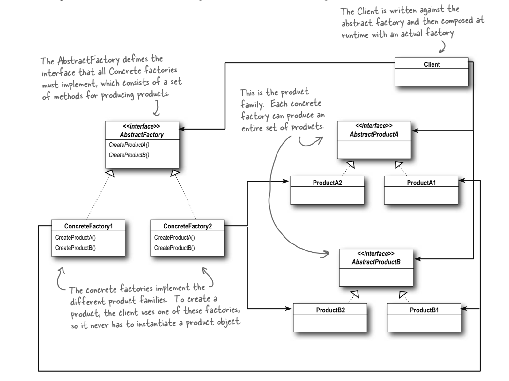

# Abstract Factory Pattern

`provides an interface for creating families of related or dependent objects without specifying their concrete classes.`

Please read up on the factory pattern first

### Playground



## What is she all about

Its is building upon the factory pattern, however this is about grouping related objects. in this example we have the issue that some of the locations of pizza shops "gareths and joes" use different ingredients for their pizzas.

We should be able to still have pizzas unaware of the dough and source that is used on them. Just know that they have them and likewise each "region" or family should be able to customise them as they need.

We do this by having a factory interface for this group, in this case an ingredients factory interface. Each location implements its own factory for ingredients. then when the locations make a pizza they inject the factory into the pizza. This way you can think of this:

* A Cheese pizza from Joes always has a pesto base and thic crust
* A Cheese pizza from gareths always has tomato base and a thin crust
* The pizza does not care where it is made, it is just a pizza with some ingredients.

## A quote from the book:

That was quite a series of code changes; what exactly did we do?

We provided a means of creating a family of ingredients for pizzas by introducing a new type of factory called an Abstract Factory.

An Abstract Factory gives us an interface for creating a family of products. By writing code that uses this interface, we decouple our code from the actual factory that creates the products. That allows us to implement a variety of factories that produce products meant for different contexts – such as different regions, different operating systems, or different look and feels.

Because our code is decoupled from the actual products, we can substitute different factories to get different behaviors \(like getting marinara instead of plum tomatoes\).

## A parting word on the difference

I find it quite hard to work out the difference so here is another synopsis:

### Abstract Factory:

use whenever you have families of products you need to create and you want to make sure your clients create products that belong together.

### Factory Method

use to decouple your client code from the concrete classes you need to instantiate, or if you don’t know ahead of time all the concrete classes you are going to need. To use, just subclass and implement my factory method!

