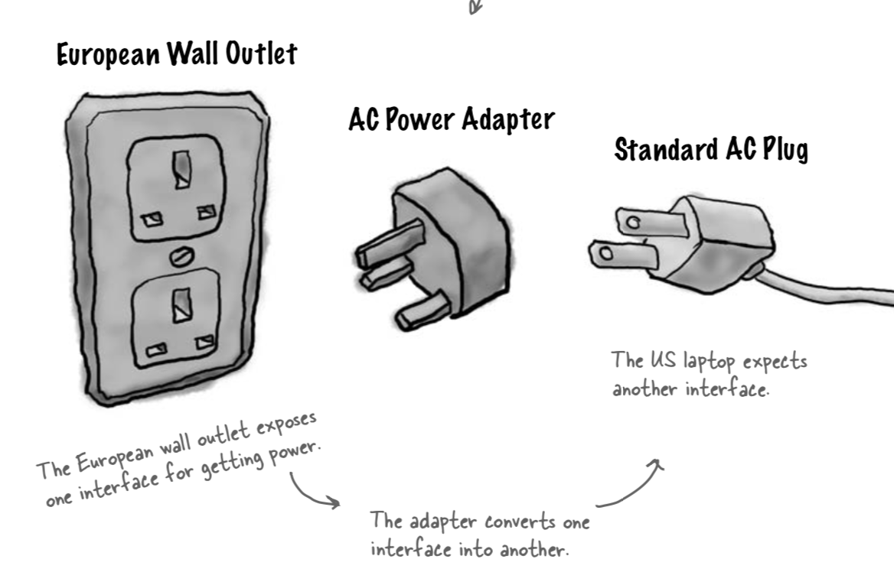
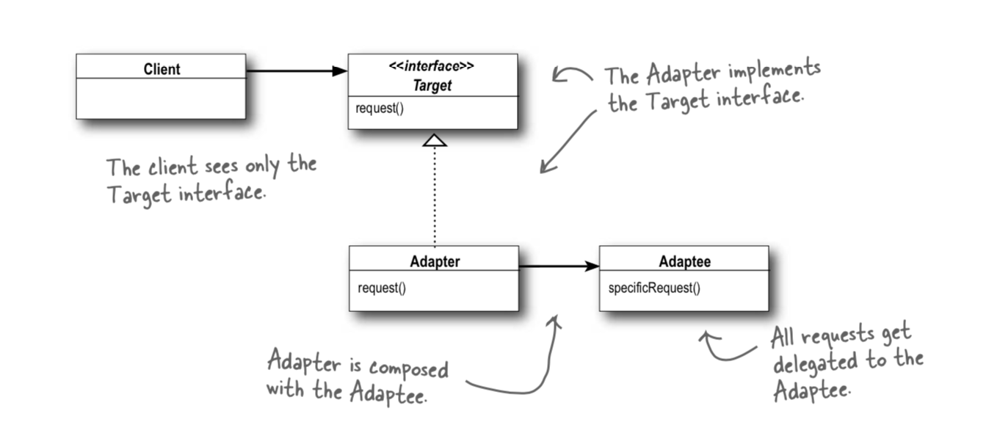

# Adapter Pattern

## Adapter pattern

`converts the interface of a class into another interface the clients expect. Adapter lets classes work together that couldn’t otherwise because of incompatible interfaces.`

## Playground



## What is it

Think of a plug adapter it allows us to connect two things together that have different interfaces by adding some code in-between. As with the example in this app, the turkey to duck code does just that it takes a turkey and makes code that enables it to conform to the duck interface.

