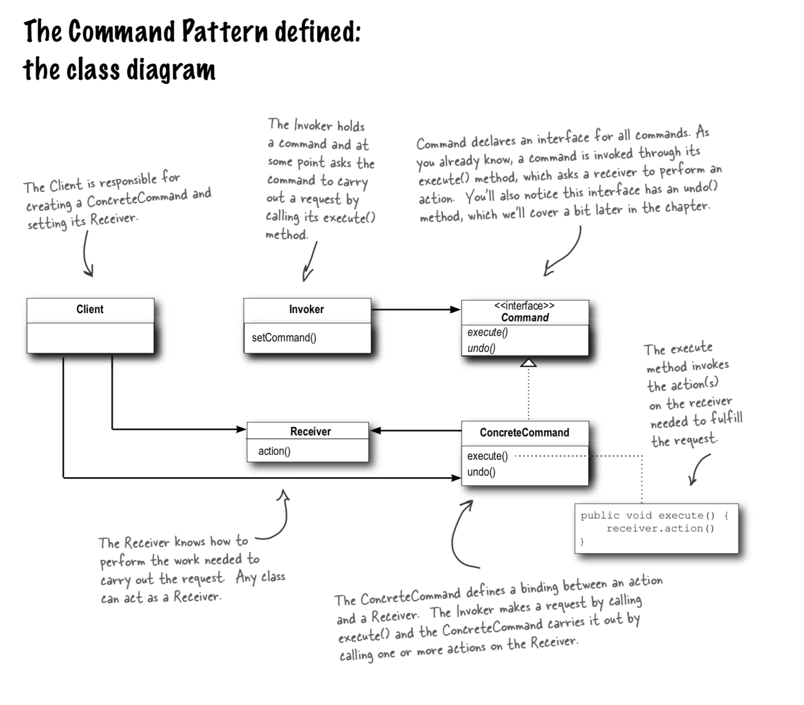

# Command pattern

## Command pattern

> encapsulates a request as an object, thereby letting you parameterize other objects with different requests, queue or log requests, and support un-doable operations.

## Playground



## What is it

With the command pattern you can have a function like `getThings` which will do different things when a different command is loaded in.

You could have some commands, these are just instances of classes that follow your definition of what it is to be a command. An example could be "all commands have a run function and a rerun function"

then you have something that can store a command and run it. This guy could have an execute command that in turn calls it's current commands run function. for example you have the following commands

* command one:
  * run: stop walking
  * rerun: jump
* command two:
  * run: run
  * rerun: fall over

then we do something like this

`const c1 = new commandOne(); const c2 = new commandTwo()`

we have a class that is like this:

`class thing { command: Command; execute() { this.command.run() }}`

What is great about this is that we can just have one function execute but it will do different commands depending on which one is currently set. for example:

`const t = new thing(c1); t.execute();`

will give us: 'stop walking' and next we can do this:

`t.command = c2; t.execute()` which is the same function call but with different results.

### But why?

there are times when you can have many "things" which will have methods that have different names like "lightOn" and "openDoor" but depending on which one is currently active you need an API to be able to press a button and do what command is active.

Imagine you also have a button on the website, it first says "register" which will run one command on click to show the form. But this is a fancy form and the button is the same but it needs to also "submit" after filling in the form.

The commands in this case are

* showForm
* submitRegistration

they are on the same button and clicking them will fire the 'click' method aka 'execute' in our last example. But they do different things, this is a sample of the command button that is used `ALL` the time in the web :D

