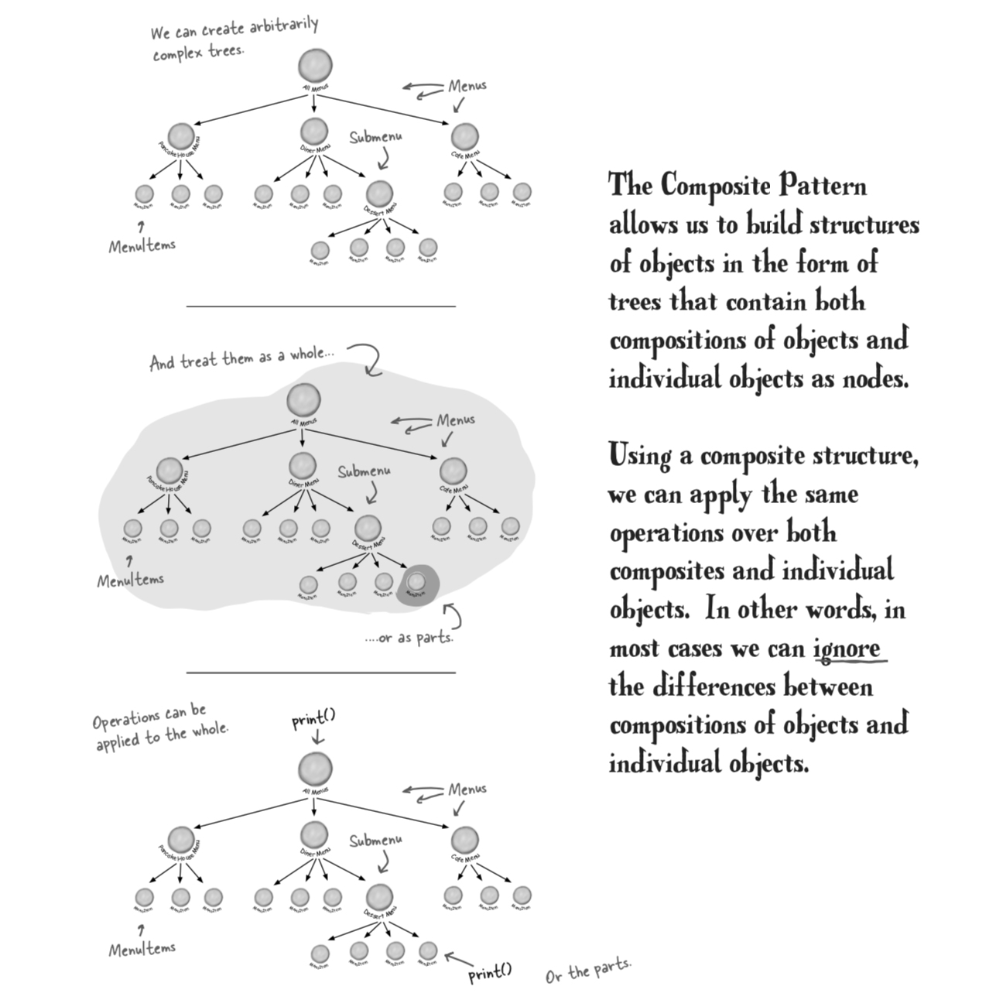
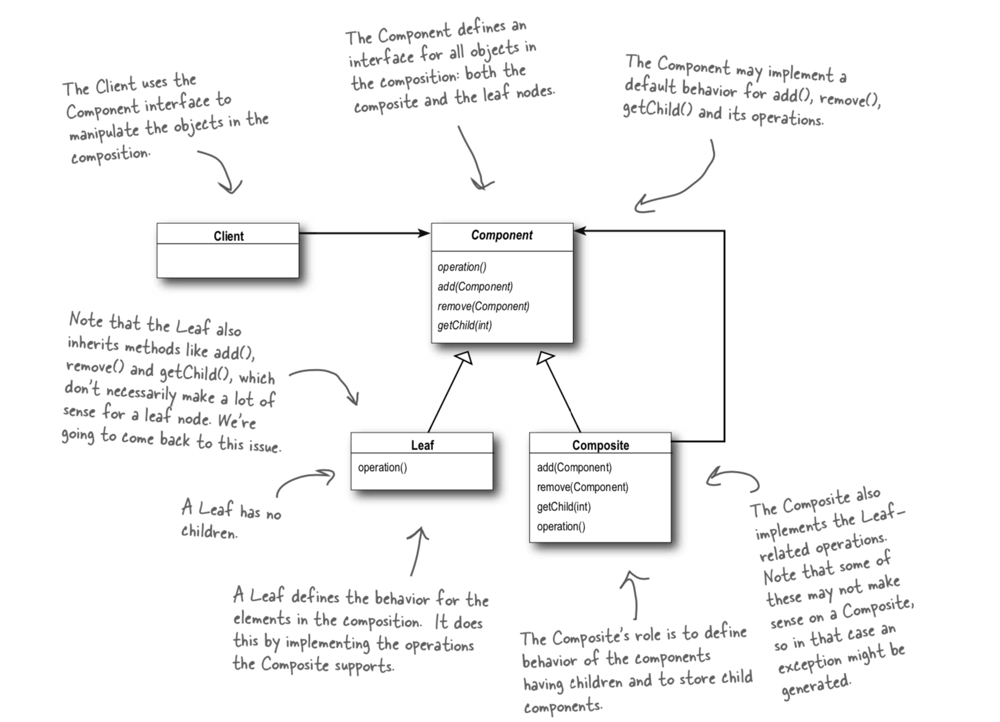

# Composite Pattern

### Composite pattern

> `allows you to compose objects into tree structures to represent part-whole hierarchies. Composite lets clients treat individual objects and compositions of objects uniformly.`

### Playground



### What is it

The composite pattern is where you have a type of object that can either be a leaf or a node in a tree structure. This is useful because you could, as with our code example \(above\) have a menu and in that menu we can have another nested menu or a menu item. This then means we can have a tree of unknown size but we know the composite object supports both.

### In conjunction with Iterators.

In our code example we borrow from the iterator pattern to show how we can iterate through a tree of any size to really show off the power of the composite pattern. Not only do we iterate through all the objects to call the print method, we also can use the iterator to, as an example get all the vegetarian dishes on the menu :D

