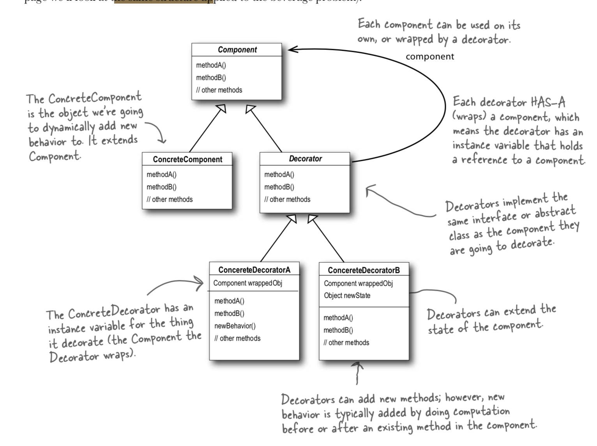

# Decorator pattern

`attaches additional responsibilities to an object dynamically. Decorators provide a flexible alternative to subclassing for extending functionality.`

* Decorators have the same supertype as the objects they decorate.
* You can use one or more decorators to wrap an object.
* Given that the decorator has the same supertype as the object it decorates, we can pass around a decorated object in place of the original \(wrapped\) object.
* Objects can be decorated at any time, so we can decorate objects dynamically at runtime with as many decorators as we like.
* The decorator adds its own behavior either before and/or after delegating to the object it decorates to do the rest of the job

