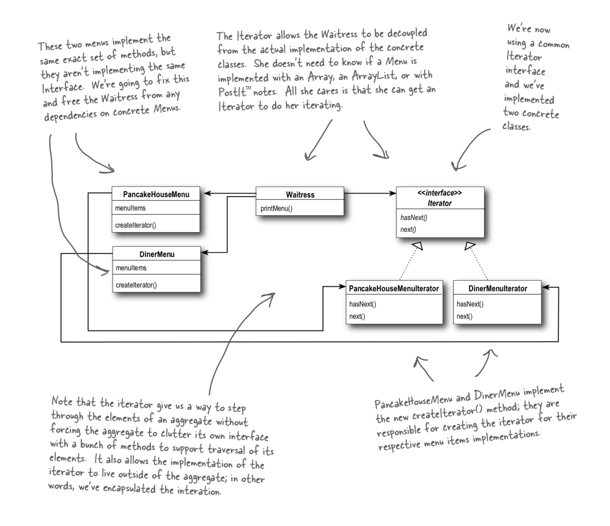

# Iterator Pattern

## Iterator Pattern

`provides a way to access the elements of an aggregate object sequentially without exposing its underlying representation.`

## What is it

It is just a way of abstracting away the iteration of 'something' from the consumer of that thing.

you should not need to loop through and handle various data constructs in the consumer of the lists, especially when they are going to be used in the same way.

for example you could have a shopping list of items and a list of baseball players but you want to take those two lists together and loop through them using the same code as you know they have a name.

well, rather than worry about the actual looping as they could be in any construct you would have an iterator. Armed with the knowledge you have a next\(\) and a hasNext\(\) you can while loop the has next and pull the next item out, knowing it has a name.

tldr: used to iterate over lists of various types.

