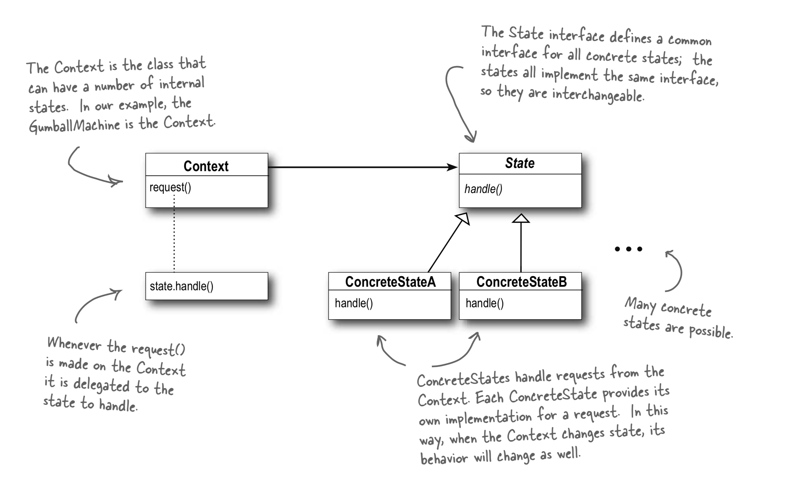

# State Pattern

### State Pattern

> allows an object to alter its behaviour when its internal state changes. The object will appear to change its class.

### Playground



### What is it

The state pattern is where we have some 'states' that something can be in and we want to something to react to that state in different ways \(depending on the current state we are in\).

This can mean, in it's most basic inception that we have an enum with some states and some functions that have if else conditions based on the current value of the state. for example something like this:

```text
enum state = { in = 0, out = 1}

class something {
    currState = state.in;
    
    doActionOne() {
        if (this.currState == state.in) {
          ...
        } else if (this.currState = state.out) {
          ...
          // maybe also change the current state
          this.curr = state.in;
        }
    }
}
```

But as you can imagine with many states and many actions you will have lots of open close violations and mess in here.

Take a look at the code sample for a cleaner version of this in TS using a gumball machine and how we move all the 'how to act in different states' out into classes. This is just a style choice both examples are just examples of transitioning state internally and then having different behaviour for actions based on the current state.




