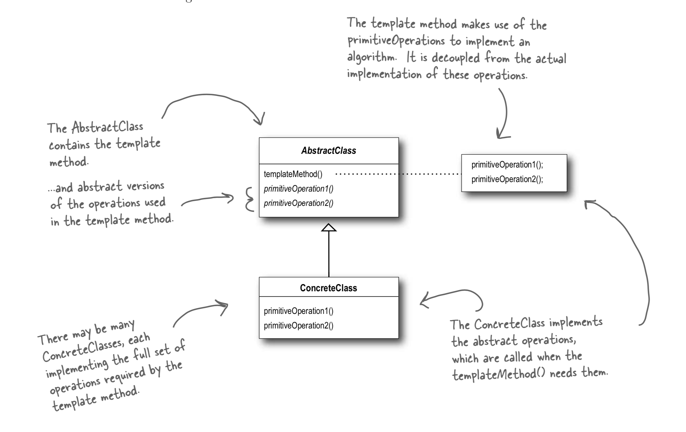

# Template Method Pattern

## Template Method pattern

`The Template Method Pattern defines the skeleton of an algorithm in a method, deferring some steps to subclasses. Template Method lets subclasses redefine certain steps of an algorithm without changing the algorithm’s structure.`

## What is it

It is just a method that is a template for an algorithm. In our case we had the template method prepare\(\) which was the template method. This method does not care how the steps are implemented but will just call some methods to get something done.

Using this in an abstract class allowed us to make the actual implementation of some of those method steps different. In the case of the Tea we can do something different for the steps brew and addCondiments, likewise with Coffee.

But the template method does not care it just calls those methods in order of which some are customized in the sub classes.

## With hooks

You do not have to make the subclasses use all the methods either. You can make a method on the abstract class that is not required to be implemented or that has a default value. Then if you want on the subclass you can 'hook' into that functionality.

An example we have in our code is the useCondiments function is optional based on the subclass if we want to even use that step. That means that the function addCondiments you can add a default implementation in the super class as it is now and optional hook.

